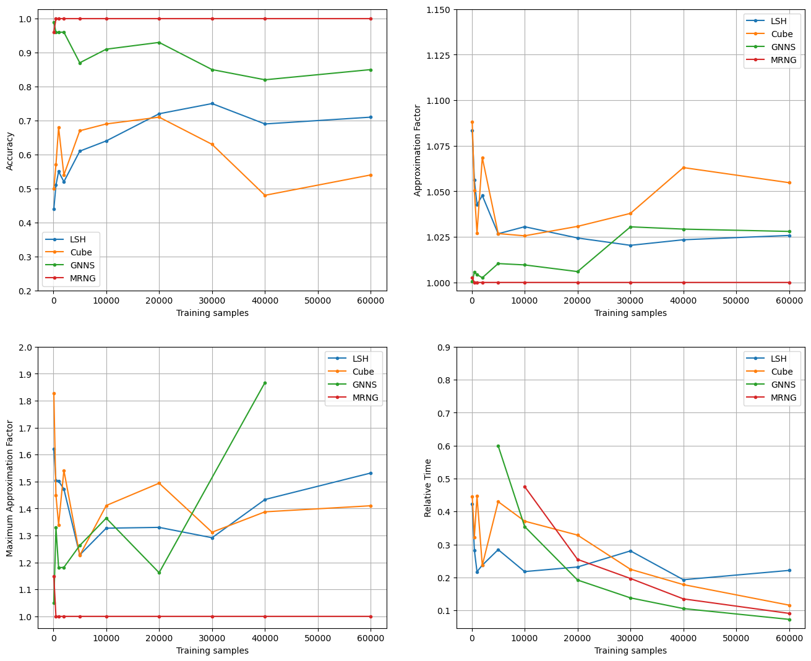

# Software Development for Algorithmic Problems

## Authors
- `1115202000018`: Georgios-Alexandros Vasilakopoulos
- `1115202000154`: Georgios Nikolaou

## Description

Development of approximal searching and vector clustering algorithms in C++: 

- *k-Nearest Neighbours* and *Range Search*, using:
    - Locality Sensitive Hashing (LSH)
    - Hypercube Random Projection (Cube)
	- Graph Nearest Neighbour Search (GNNS)
	- Monotonic Relative Neighbourhood Graph (MRNG)

- **Lloyds's** clustering algorithm
- **Reverse Search** clustering, enhanced with approximal searching.


The algorithms are benchmarked on the [MNIST handwritten digit](http://yann.lecun.com/exdb/mnist/) dataset, where each 28 x 28 image is represented as a 784 - dimensional vector.

## File Structure

<pre>
.
├── Makefile
├── README.md
├── graphs
│   └── ...
├── input
│   ├── test_images
│   └── train_images
├── output
│   ├── configs
│   │   └── ...
│   └── plots
│   │   └── ...
└── src
    ├── bench.conf
    ├── benchmark.cpp
    ├── benchmarks.bash
    ├── approximators
    │   ├── cube
    │   │   ├── include
    │   │   │   ├── cube.hpp
    │   │   │   └── cube_hash.hpp
    │   │   ├── main.cpp
    │   │   └── modules
    │   │       └── cube.cpp
    │   └── lsh
    │       ├── include
    │       │   ├── lsh.hpp
    │       │   └── lsh_hash.hpp
    │       ├── main.cpp
    │       └── modules
    │           └── lsh.cpp
    ├── cluster
    │   ├── main.cpp
    │   ├── cluster.conf
    │   ├── include
    │   │   └── cluster.hpp
    │   └── modules
    │       └── cluster.cpp
    ├── common
    │   ├── main.cpp
    │   ├── include
    │   │   ├── Approximator.hpp
    │   │   ├── ArgParser.hpp
    │   │   ├── FileParser.hpp
    │   │   ├── HashTable.hpp
    │   │   ├── Vector.hpp
    │   │   └── utils.hpp
    │   └── modules
    │       ├── Approximator.cpp
    │       ├── ArgParser.tcc
    │       ├── Distances.tcc
    │       ├── FileParser.tcc
    │       ├── HashTable.tcc
    │       ├── Vector.tcc
    │       └── utils.cpp
    ├── graph
    │   ├── main.cpp
    │   ├── tune.py
    │   ├── include
    │   │   └── Graph.hpp
    │   └── modules
    │       └── Graph.cpp
    └── plot.py
</pre>

## Data Handling

- The input data is loaded into a `DataSet` object, where each data instance is represented by a `DataPoint` object. 

- Each `DataPoint` encapsulates a unique ID and a vector of type `Vector<uint8_t>`.

- The `Vector<>` template class allows convenient manipulation of vectorized data, through constructs such as overloaded operators, type conversions and indexing. 

Related Modules: `common/modules/Vector.tcc`, `common/modules/utils.cpp`


## Approximators

The `Approximator` abstract class is a 'base' class that stores a `DataSet` reference and provides functions for

- K Nearest Neighbours `kNN( )`
- K Approximate Nearest Neighbours `kANN( )` (pure virtual)
- Range Search `RangeSearch( )` (pure virtual)

Each of these functions takes as arguments:

- A metric function (such as the `l2` metric)
- A query `DataPoint`
- Algorithm-related parameters

And returns the unique vector IDs that were found by the respective search algorithm.

Both `LSH` and `Cube` are subclasses of `Approximator` and implement `kANN( )` and `RangeSearch( )` accordingly.

### LSH

```
$ make lsh
$ ./lsh –d <input file> –q <query file> –k <int> -L <int> -ο <output file> -Ν <number of nearest> -R <radius>
```

The `LshAmplifiedHash` class implements the `LSH` algorithm. It encapsulates multiple `LshHash` object, each of which maps a vector to a *random hyperplane*, defined by a random vector `v` and a random scalar `t`. When applied to a vector `p`, it produces a randomly weighted linear combination of the `LshHash` outputs, applied on `p`.

The `LSH` class contains several hashtables, each defined by a unique `LshAmplifiedHash`. Each hashtable is populated with the entire dataset. When applying a search algorithm for some query, the *candidate neigbours* are those that are contained in the hashtable buckets that the query would be placed in. 

### Cube

```
$ make cube
$ ./cube –d <input file> –q <query file> –k <int> -M <int> -probes <int> -ο <output file> -Ν <number of nearest> -R <radius>
```

The `CubeHash` class implements the *Hypercube Projection* algorithm. It encapsulates multiple `LshHash` objects. When applied to a vector `p`, it produces a random projection into binary vector that corresponds to a hypercube vertex. 

The `Cube` class contains a single hashtable, defined by a unique `CubeHash` and populated with the entire dataset. The number of buckets is equal the number of vertices of the *k*-dimensional hypercube (*2^k*). When applying a search algorithm for some query, the *candidate neigbours* are searched in hypercube vertices of ascending hamming distance in relation to the vertex that the query would be placed in. 


## Clustering

```
$ make cluster
$ ./cluster –i <input file> –c <configuration file> -o <output file> -complete <optional> -m <method: Classic OR LSH or Hypercube>
```

- The `Cluster` class stores pointers to `DataPoint` objects that are members of the cluster. It provides several functionalities that are essential for the management of a cluster:

	- Inclusion of a datapoint in the cluster, `add( )`
	- Removal of a datapoint from the cluster, `remove( )`
	- Center calculation, `update( )` 

- `Clusterer` is an abstract class, the objects of which are **handles** for clustering algorithms. Upon construction, a `Clusterer` object stores a reference to a `DataSet` object and performs the *k-means++* algorithm for the initialization of the clusters.

- `Lloyd` is a subclass of `Clusterer` that implements the classical clustering algorithm augmented with the *MacQueen* update step, through the `apply( )` function.

- `RAssignment` is also a subclass of `Clusterer`. Additionally to the common parameters, it also stores an `Approximator` object (`LSH` or `Cube`), that is used in order to accelerate the clustering process, with the tradeoff of finding *approximate* neighbours.


## Graph

```
$ make graph_search
$ ./graph_search –d <input file> –q <query file> –k <int> -E <int> -R <int> -N <int> -l <int, only for Search-on-Graph> -m <1 for GNNS, 2 for MRNG> -ο <output file>
```


### GNNs

The `GNN` class implements the *Graph Nearest Neighbor Search*. Upon initialization, for each point of the dataset (i.e. node of the graph), its k nearest neighbors are connected with edges. The k nearest neighbors are determined with either the *LSH* or *HyperCube* approximation algorithms.


When querying for a point `q`:
- A special graph search is initialized at a randomly chosen point. 
- At each of the `E` iterations, the neighbors of the selected point are fetched and the next selected point is determined according to distance from `q`. 
- This entire process is repeated `R` times.
- In the end, out of all the visited points, the `k` closest ones to `q` will be returned.


### MRNG

The `MRNG` class implements the *Monotonic Relative Neighborhood Graph*. During initialization, for each point `p`, its k nearest neighbors are found; each of the knn's are linearly added as edges only if their distance to `p` is smaller than the distance to all of the *already placed* graph-neighbors of `p`.

When querying for a point `q`:
- A *search* is initialized at some (given) starting point
- At each iteration, the search is expanded to the neighbors of the node which is closest to `q`
- Naturally, this search algorithm utilizes a priority queue, the size of which is bounded by a given parameter `L`.
- When the limit `L` is reached, the top `k` nodes of the priority queue are returned.


## Autoencoder

The `src/autoencoder/` directory contains several Python scripts for training, tuning and utilizing Autoencoders for dimensionality reduction. 


- The `Autoencoder()` function, defined in `src/autoencoder/model.py`, is used for defining a TensorFlow Autoencoder model, given the following parameters:
    -  *Input Shape*
    -  *Latent dimension*
    -  *Convolution Layer Sizes*
    -  *Batch Normalization*
    -  *Kernel Size*
    -  *Activation Function & Parameters*

- For training an Autoencoder model with a certain set of parameters, the script `src/autoencoder/models/train.py` is used as follows:

    ```
    $ train.py --train_path <> --test_path <> --latent_train_path <> --latent_test_path <> --planes <> --depth <> --norm <> --kernel_size <> --epochs <> --lr <> --batch_size <>
    ```

    During the training process, the **Adam optimizer** is used, along with **Mean Squared Error** as loss function. Also, **Early Stopping** is enforced, in order to prevent the model from overfitting.


- Using the script `src/autoencoder/models/tune.py`, one can determine the optimal set of hyperparameters of an Autoencoder, for dimensionality reduction in the handwritten digit problem.


    The optimal set of hyperparameters is obtained through a standard *Grid Search* algorithm:


    ```
    param_grid = [

        {'depth': [2], 'planes': [[16, 8], [16, 32], [32, 16]], 
         'kernel_size': [3, 5], 'lr': [1e-4], 'batch_size': [64, 128],
         'norm': [False],
         'latent_dim': [10, 16, 22]},

        {'depth': [3], 'planes': [[32, 16, 8], [16, 32, 48], [48, 32, 16]], 
         'kernel_size': [3, 5], 'lr': [1e-4], 'batch_size': [64, 128],
         'norm': [False],
         'latent_dim': [10, 16, 22]},
    ]
    ```

    It is important to note that each trained model is evaluated according to the **ability to accurately predict nearest neighbors** in the reduced dimension.

- The script `src/autoencoder/models/tune.py` is used for converting datasets down to lower dimensions, using the encoder of the model that was produced after running *Grid Search*:

```
$ python reduce.py –d <dataset> -q <queryset> -od <output_dataset_file> -oq <output_query_file>
```

## Benchmarking

```
$ make benchmark
$ ./benchmark –d <input file> –q <query file> -ο <output file> -c <csv file> -config <parm. configuration file> -size <size to truncate input file, 0 for no truncation>
```

In order to thoroughly test the performance of the two graph models, we developed a script that runs queries on all of the developed models (LSH, HyperCube, GNN, MRNG) and quantifies their performance based on various metrics, namely:

- Accuracy
- Approximation Factor
- Maximum Approximation Factor
- Average Relative Time (to brute force quering)

To produce the metrics for various data sizes, execute `./benchmarks.bash`. Script description:
- Functionality: 
	- Compiles benchmark-related files 
	- Runs the corresponding executable several times with different train set sizes
	- Produces the plots using python: `plot.py`
	- Optionaly, loads the graph instead of computing it
- Input: 
	- Train and Test Datasets
	- Config File
	- Output File
- Output: 
	- Depending on flags: `.graph` file containing the initialized graphs
	- A text file for each train set size, containing the reported metrics for each algo
	- A csv file with the reported metrics
	- Plots for each metric
 

## Evaluation

### Approximate K-NN

We evaluate the performance of both approximate K-NN algorithms (`LSH` and `Cube`) with the following two metrics:
- **Relative Time Perfomance**: Execution time of the approximal algorthm (`LSH` or `Cube`), divided by the execution time of the *naive* algortihm. Closer to 0 is better.
- **Approximation Factor**: The average distance between approximate and true nearest neighbours. Closer to 1 is better.

Each algorithm is executed 10 times and the values reported are an average of these executions.

In both cases, the results prove that the algorithms approximate the nearest neighbours exceptionally well, while taking a fraction of the time. 

It is worth noting that the appropriate selection of hyper-parameters is essential to achieving good performance.

#### LSH Parameters and Performance

- **Relative Time Perfomance**: 0.2486
- **Approximation Factor**: 1.0418

Using parameters: `–k 4 -L 5 -Ν 10`,&nbsp; and `table size = n / 8`, &nbsp; `window = 2600` 

#### Cube Parameters and Performance

- **Relative Time Perfomance**: 0.1204
- **Approximation Factor**: 1.1093

Using parameters: `–k 7 -M 6000 -probes 10 -Ν 10`,&nbsp; and `window = 2600` 

### Clustering

The clustering performance is evaluated using the [Silhouette coefficient](https://en.wikipedia.org/wiki/Silhouette_(clustering)), as well as the total clustering time. The results prove that the clustering algorithms using approximal methods produce results significantly faster than the traditional approach, while maintaining accuracy.

In all cases, we search for 10 clusters, one for each digit.

For Reverse Assignment we use the parameters mentioned in the previous section.

#### Lloyd's Algorithm
- Clustering time: `33.760`
- Silhouette for each cluster: `[0.118, 0.137, 0.156, 0.369, 0.191, 0.230, 0.100, 0.283, 0.179, 0.099]`
- Silhouette coefficient: `0.179`


#### Reverse Assignment using LSH
- Clustering time: `4.166`
- Silhouette for each cluster: `[0.088, 0.149, 0.045, 0.347, 0.017, 0.068, 0.069, 0.074, 0.105, 0.068]`
- Silhouette coefficient: `0.099`


#### Reverse Assignment using Cube
- Clustering time: `1.345`
- Silhouette for each cluster: `[0.037, 0.139, 0.075, 0.196, 0.107, 0.213, 0.084, 0.059, 0.091, 0.127]`
- Silhouette coefficient: `0.127`

### Graph

#### Parameter Tuning

To facilitate parameter tuning we created the `tune.py` file. To execute run: 
```
$ cd ./src/graph/
$ python tune.py 
```

We perform an execution of `benchmarks.bash` on every combination of the following parameters:
- `R`: `[1, 5, 10, 15]`
- `T`: `[10, 20, 30]`
- `E`: `[30, 40, 50]`
- `l`: `[1, 10, 100, 1000, 2000]`

The resulting plots can be found under `output/plots/`.

#### Analysis

We found that for graph algorithms, the optimal parameters for the whole dataset, compromising on accuracy and time complexity, are:
- GNNS: `-k 150 -R 15 -T 10 -E 40`, and `T = 10`
- MRNG: `-k 150 -l 2000`, and `T = 10`

For both algorithms, the parameters used for the approximators are those of Assignment 1.




We make the following observations:
- Graph algorithms heavily depend on their parameters. We posit that these parameters should not be fixed but instead be a dependent on the training set size. This suggestion is substantiated by the observation that for smaller sizes, using smaller parameter values achieves good performance in terms of accuracy and approximation factor, all while being faster than the alternatives. Conversely, for larger parameter values, although performance increases marginally, querying time experiences an exponential increase.
- Regarding the *best* parameters:
	- Graph algorithms consistently demonstrate superior accuracy compared to both `LSH` and `Cube`, regardless of the train set size. 
	- Although GNNS exhibits better accuracy than LSH, it results in higher approximation factors and maximum approximation factors. This can be attributed to the parameter R. `GNNS` heavily relies on the initial points, and the use of only 15 random samples may at times be insufficient for achieving a satisfactory approximation enough times to skew the average.
	- While graph algorithms demonstrate faster performance than both LSH and Cube on larger train set sizes, they exhibit significant shortcomings for smaller data sizes.

